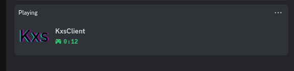
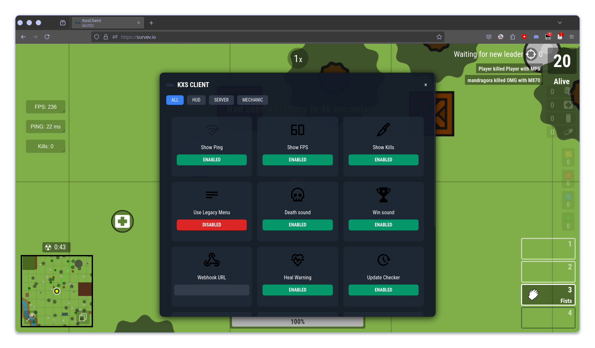

# [KxsClient](https://kxs.rip) - Surviv.io (legit) client  

[KxsClient](https://kxs.rip) (short for Kisakay x Surviv) is a free and open-source game client written in TypeScript, transpiled to JavaScript using Webpack.  
KxsClient includes over 20 fully configurable mods with a beautiful and user-friendly UI.  

---

## Features  

- **Discord Rich Presence**  
    

- **Beautiful right-shift menu**  
    

- Fully customizable HUD  
- Game logging (with webhook support)  
- Heal warning  
- Update checker  
- Win/Lose animations  
- Kill leader stats  
- And many more features to come!  

---

## Fork of SoyAlguen Client  

[KxsClient](https://kxs.rip) started as a fork of the original SoyAlguen client. After countless hours of work, the [KxsClient](https://kxs.rip) has evolved into something entirely different.  

Unlike SoyAlguen, [KxsClient](https://kxs.rip) is not a script to replace on the Surviv.io page. Instead, it's a script that can be loaded using a script manager (like Tampermonkey).  
This means [KxsClient](https://kxs.rip) works seamlessly on any web browser that supports custom scripts 😎  

---

## [KxsClient](https://kxs.rip) is fully operational  

Yes, the release is stable and ready to use, even for competitive gameplay!  

---

### Is [KxsClient](https://kxs.rip) a cheat client?  

Absolutely not! [KxsClient](https://kxs.rip) fully adheres to Surviv.io's rules and respects the Terms of Service. You can play with confidence, without any issues.  

---

### How to contact me  

Feel free to DM me on Discord: `kisakay`. You can also find me on the official Surviv.io Discord server ✨  

---

### Is it free to use?  

Yes, totally! [KxsClient](https://kxs.rip) is released under the MIT license, so you're free to modify, redistribute, or even use it commercially. Pretty much anything goes!  

---